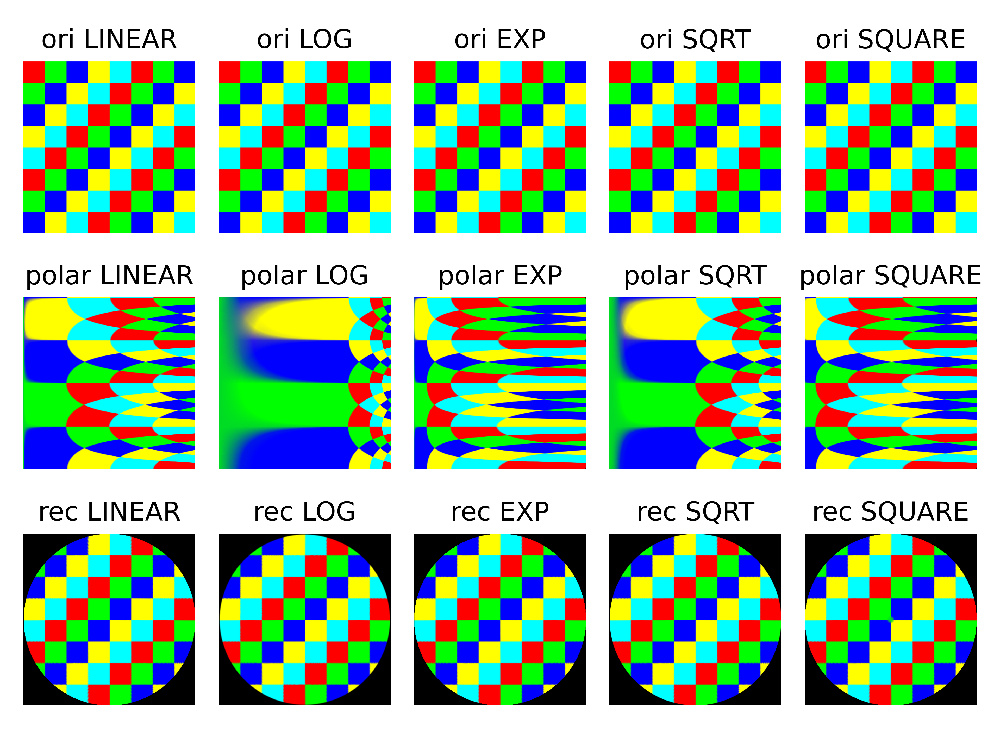

# RRE
Mapping an image from Cartesian space to Polar space

Adding new functionality to `cv.warpPolar` in [opencv](https://github.com/opencv/opencv/)

Resolved edge information loss and omissions in cart2pol transformations, improving accuracy for image boundaries.
Added the following macro definitions:

`WARP_POLAR_EXP`: Enables exponential sampling along the radial direction.

`WARP_POLAR_SQRT`: Similar to logPolar, supports square root sampling for smoother
scaling.

`WARP_POLAR_SQUARE`: Performs radial square sampling, compensating for shrinking
sectors to preserve edge details.

## test
Run `python main.py img.png` will obtain the figures below. 
- The first row is the original image in Cartesian space;
- the second row is the image transformed into polar coordinate space;
- and the third row is the image transformed back into Cartesian space.

The first two columns are generated using the original `cv2.WARP_POLAR_LINEAR` and `cv2.WARP_POLAR_LOG`.

Another example

